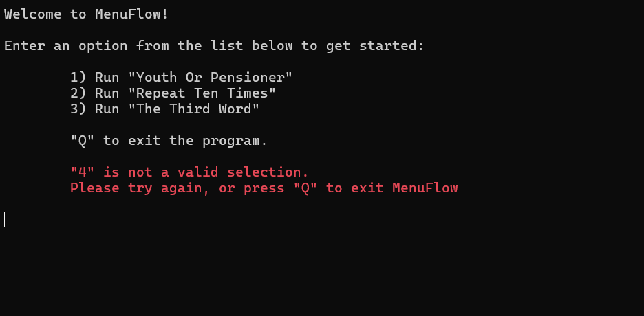
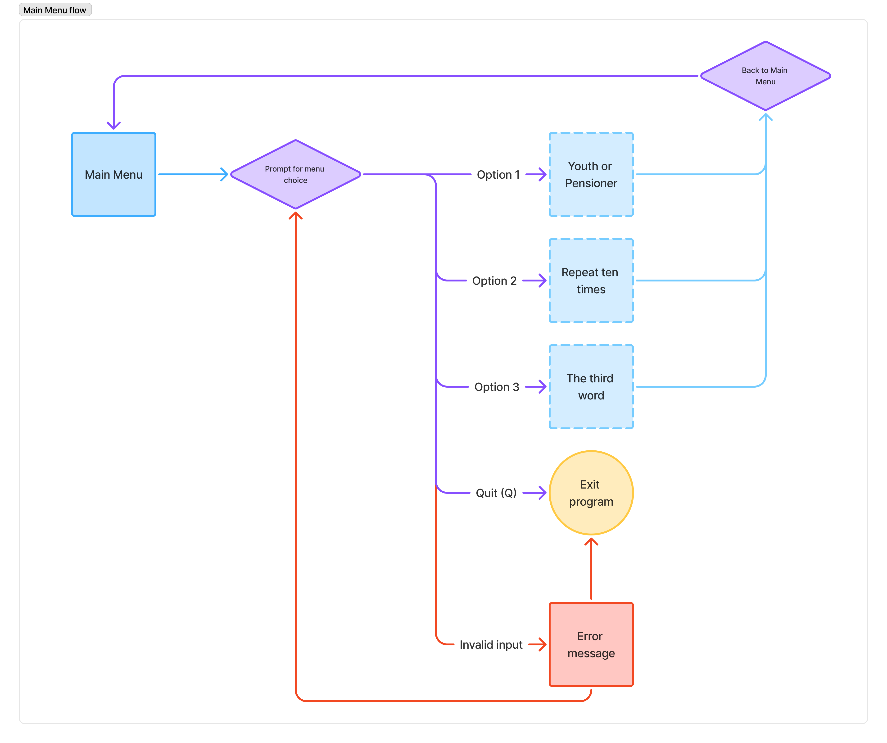

# C# exercise 2 - Flow control and string manipulation

This is the second C# exercise for the Full-stack system developer program from Lexicon.

## MenuFlow
The program implements a simple console-based menu system that allows users to select from various programs from a main menu.

### Main menu 

The menu is displayed in a loop until the user selects a valid option or  chooses to exit the program:
1) [Youth or Pensioner](#option-1-youth-or-pensioner)
2) Repeat ten times
3) The third word
4) (Q) Exit program

### Option 1: Youth or Pensioner
To demonstrate if statements, a fictional local movie theater offers discounted tickets for youth (under 20) and pensioners (64 and older). The user is prompted to enter their age, and the program determines if they are eligible for a discount, displaying the resulting price.

The program should also be able to calculate the price for a group of people. The user is prompted to enter the number of people in the group, and then the age of each person. The program calculates the total price for the group based on the individual prices and prints out a summary containing the number of people and the calculated total price.

### Option 2: Repeat ten times
To demonstrate `for` loops, this program should prompt the user to enter a word into the console. The program then outputs that word ten times on a single line.

### Option 3: The third word
Working with string manipulation, this program should take a sentence from the user and output the third word. The program will use `string.Split(char)` to split the sentence into individual words and store these in a variable.