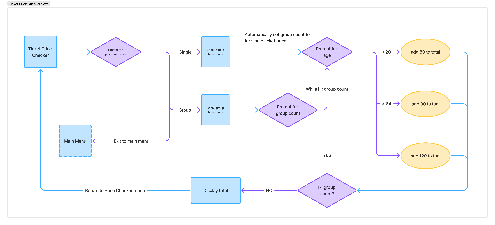

# C# exercise 2 - Flow control and string manipulation

## Overview
This is the second C# exercise for the Full-stack system developer program from Lexicon.

### Option 1: Youth or Pensioner
To demonstrate if statements, a fictional local movie theater offers discounted tickets for youth (under 20) and pensioners (64 and older). The user is prompted to enter their age, and the program determines if they are eligible for a discount, displaying the resulting price.

The program should also be able to calculate the price for a group of people. The user is prompted to enter the number of people in the group, and then the age of each person. The program calculates the total price for the group based on the individual prices and prints out a summary containing the number of people and the calculated total price.

### Option 2: Repeat ten times
To demonstrate `for` loops, this program should prompt the user to enter a word into the console. The program then outputs that word ten times on a single line.

### Option 3: The third word
Working with string manipulation, this program should take a sentence from the user and output the third word. The program will use `string.Split(char)` to split the sentence into individual words and store these in a variable.

## Exercise solution: MenuFlow
MenuFlow is the main program used to to implement the exercise solution. The program implements a simple console-based menu system that allows users to select from various programs from a main menu and sub-menus.

### Main menu 

The menu is displayed in a loop until the user selects a valid option or  chooses to exit the program:

0) (Q) Exit program
1) Youth or Pensioner
2) Repeat ten times
3) The third word

## MenuFlow.Library
Some of the characteristics of the main menu would also be useful in other areas of the application, such as rendering a list or selecting an action to perform. I tried to identify these characteristics and abstract them into a utility library so that they could be used in several places in the program.
By the end of the exercise, the `MenuFlow.Library` consists of:

### `IMenuListable`
This interface describes what is required of an application  to be added to a menu option. It needs to have a `Name` and be able to call a `Render` method.

### `IMenuContext`
This describes what is required of a class for it to hold state in a `MenuContext`.

### `Menu`
The base class for a `Menu` can have a list of `IListable` items and is itself a an `IListable` so that we can have sub-menus. Also implements `IMenuContext`.

### `MenuApplication`
This is also `IListable` but does not contain additional items. Also implements `IMenuContext`.

### `MenuOption`
The items displayed in a `Menu`. 

### `MenuContext`
This is a global state object. Each class instance that implements `IMenuContext` can register its own context which is used to keep track of the current selected menu action.

## Ticket Price Checker

(Description WIP)

## Repeat Ten Times

(Description WIP)

## The Third Word

(Description WIP)